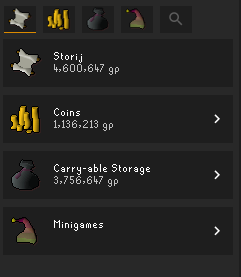
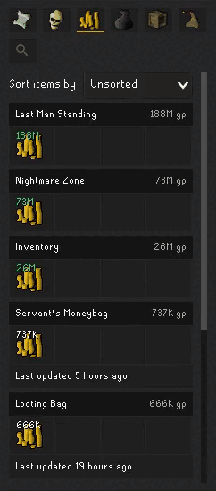
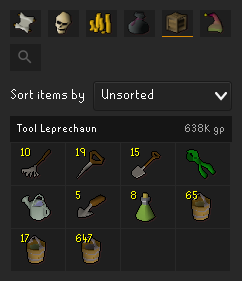
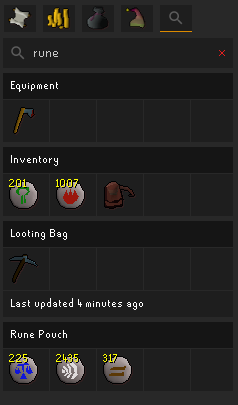

# Dude, Where's My Stuff?

Helps you keep track of your stuff (items, gp, minigame points) in Old School RuneScape by recording
and showing you where they are in an easy to view way.

## Current features

* View storage for alt characters
* Overview of your storages, including total account wealth

* Death storage
    * Deathbanks
    * Deathpiles

* Coin tracking
    * Blast Furnace coffer
    * Inventory
    * Last Man Standing coffer
    * Looting bag
    * Nightmare Zone coffer
    * Grand Exchange (cancelled offers only)
    * Servant's Moneybag
    * Shilo Village Furnace

* Carry-able storage
    * Equipment
    * Inventory
    * Looting bag
    * Rune pouch
    * Seed box

* World storage
    * Tool Leprechaun

* Minigame points
    * Barbarian Assault
    * Last Man Standing
    * Mage Training Arena
    * Nightmare Zone
    * Tithe Farm

* Storage-wide search for items

## Planned features

Check out the Trello board: https://trello.com/b/YMugGCCW/dude-wheres-my-stuff
