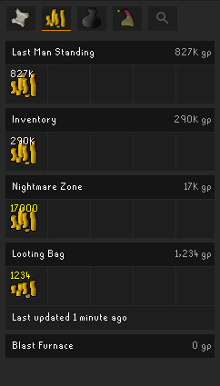
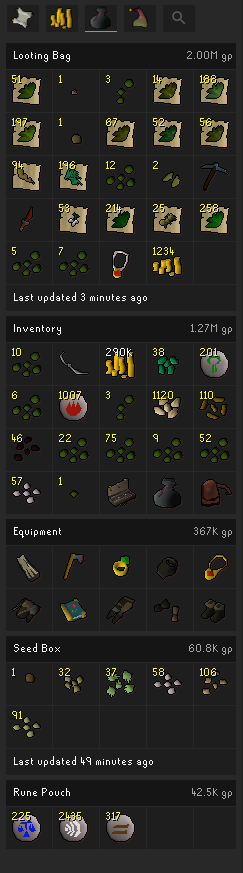

# Dude, Where's My Stuff?

 

Helps you keep track of your stuff (items, gp, minigame points) in Old School RuneScape by recording and showing you where they are in an easy to view way.

## Current features

* Overview of your storages, including total account wealth

* Coin tracking
  * Blast Furnace coffer
  * Inventory
  * Last Man Standing coffer
  * Looting bag
  * Nightmare Zone coffer

* Carry-able storage
  * Equipment
  * Inventory
  * Looting bag
  * Rune pouch
  * Seed box

  

* Minigame points
  * Barbarian Assault
  * Last Man Standing
  * Mage Training Arena
  * Nightmare Zone
  * Tithe Farm

* Storage-wide search for items

## Planned features

* Carry-able storage
  * Herb sack
  * Gem bag
  * Bolt pouch
  * Plank sack
  * Fish barrel
  * Flamtaer bag
  * Tackle box
  * Gnomish firelighter
  * Master scroll book
  * Coffins
  * Essence pouches

* Minigame points
  * Pest Control
  * Tempoross
  * Guardians of the Rift
  * Slayer points
  * Soul Wars
  * Mahogany Homes

* Deathbanks
* Deathpiles
* POH storage
* Stash units
* Tool leprechaun
* Fossil storage
* Log storage
