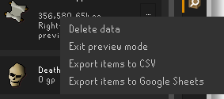
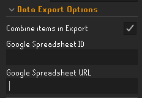

# Dude, Where's My Stuff?

Helps you keep track of your stuff (items, gp, minigame points) in Old School RuneScape by recording
and showing you where they are in an easy to view way.

## Current features

* View storage for alt characters
* Overview of your storages, including total account wealth
* Export to CSV or Google Sheets

* Death storage
    * Deathbanks
    * Deathpiles

* Coin tracking
    * Blast Furnace coffer
    * Inventory
    * Last Man Standing coffer
    * Looting bag
    * Nightmare Zone coffer
    * Grand Exchange (cancelled offers only)
    * Servant's Moneybag
    * Shilo Village Furnace

* Carry-able storage
    * Equipment
    * Inventory
    * Looting bag
    * Rune pouch
    * Seed box

* World storage
    * Tool Leprechaun

* Minigame points
    * Barbarian Assault
    * Last Man Standing
    * Mage Training Arena
    * Nightmare Zone
    * Tithe Farm

* Storage-wide search for items

* Export

You are able to select whether or not you are exporting to CSV or Google Sheets. Exporting to Google
Sheets should open a browser window to login.

If you are in a GIM or want to ensure that you reuse a specific Google Sheet, you can populate the
Google Spreadsheet ID Config. If this is not provided, a new sheet will be made. You will need write
permissions to the Google Sheet.

The **Target Google Sheet must have been created by the plugin.**

## Planned features

Check out the Github issues: https://github.com/Thource/dude-wheres-my-stuff/issues
